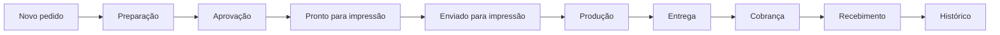
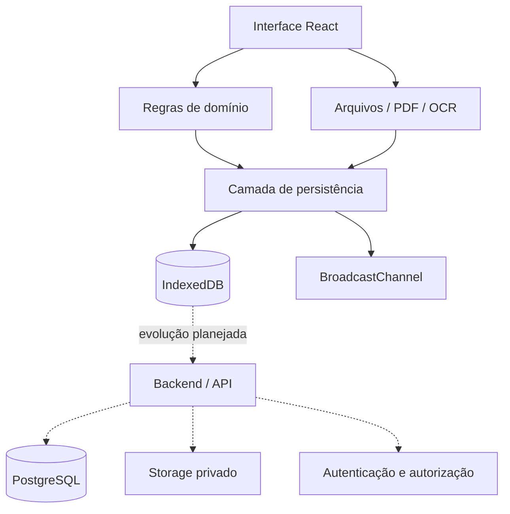

# EstampaPro

**Controle de produção para estamparias, com foco em uniformes, pedidos, peças, clientes e financeiro.**

> Este repositório é um **showcase público** do projeto. O código-fonte da aplicação é privado e não é distribuído aqui.


## Sobre o projeto

O **EstampaPro** nasceu para centralizar o fluxo operacional de uma estamparia em uma única interface. A aplicação reúne o acompanhamento do pedido desde o cadastro e preparação das peças até a entrega, cobrança e recebimento.

O protótipo atual funciona localmente e foi estruturado para validar o fluxo real de produção antes da migração para uma arquitetura com autenticação, banco de dados e armazenamento remoto.

## Áreas principais

- **Início** — visão geral da operação e indicadores derivados dos registros.
- **Pedidos** — cadastro, listagem, filtros, detalhes e acompanhamento das etapas.
- **Quadro de produção** — kanban com avanço controlado entre etapas.
- **Peças** — importação, conferência e organização da grade de produção.
- **Clientes** — cadastro, preferências, arquivamento e informações comerciais.
- **Financeiro** — cobranças, recebimentos e distribuição de pagamentos entre pedidos.
- **Histórico** — consulta de pedidos concluídos e possibilidade de reabertura.
- **Configurações** — preferências de interface, tema e acessibilidade visual.

## Fluxo de produção



O avanço das etapas possui validações próprias. Por exemplo, uma lista de peças com divergência ou conferência pendente pode impedir o avanço para impressão.

## Recursos implementados

### Gestão de pedidos

- criação de pedidos e rascunhos;
- filtros persistidos na URL;
- visualização em lista e quadro kanban;
- painel amplo de detalhes do pedido;
- programação de início e prioridade independentes da etapa;
- aprovação registrada com responsável;
- confirmação explícita de entrega;
- reabertura de pedidos concluídos.

### Bancada de peças

- importação de **Excel/CSV**;
- importação por texto colado;
- leitura de imagem com **OCR local**;
- prévia editável antes da confirmação;
- opção de substituir ou acrescentar peças;
- filtros por tamanho, gênero, modelagem e conferência;
- agrupamentos de produção;
- confirmação visual individual por peça;
- controle de divergência entre peças importadas e quantidade declarada.

Tamanhos atualmente reconhecidos:

`2, 4, 6, 8, 10, 12, 14, PP, P, M, G, GG, G1, G2, G3, G4 e G5`

### Arquivos e aprovação

- anexos armazenados localmente;
- versionamento de arquivos;
- visualização de PDF no navegador;
- escolha de uma página do PDF como capa;
- armazenamento de CDR para download, sem pré-visualização;
- limite local de 25 MB por arquivo no protótipo.

### Financeiro

- preço por peça associado ao pedido;
- geração de cobrança separada da entrega;
- registro de envio separado do recebimento;
- pagamentos parciais;
- distribuição de um pagamento entre múltiplos pedidos;
- proteção local contra duplicação de recebimento;
- demonstrativos HTML imprimíveis.

### Experiência de uso

- tema claro e escuro;
- layout responsivo;
- painel de pedido em tela cheia no celular;
- suporte a teclado/toque no avanço do kanban;
- preferências de texto e movimento;
- sincronização entre abas abertas da aplicação por `BroadcastChannel`.

## Stack

| Camada | Tecnologia |
| --- | --- |
| Interface | React 19 |
| Linguagem | TypeScript em modo strict |
| Build | Vite 6 |
| Rotas | React Router |
| Persistência atual | IndexedDB (`idb`) |
| PDF | PDF.js |
| OCR | Tesseract.js executado localmente |
| Planilhas | processamento local de XLSX/CSV |
| Ícones | Phosphor Icons |
| Tipografia | Inter / Roboto local |
| Testes | Node Test Runner + TypeScript |

## Arquitetura atual



A versão atual foi deliberadamente construída como aplicação local para validar o produto. A arquitetura permite substituir a persistência local por uma camada remota posteriormente.

## Estrutura conceitual

```text
EstampaPro
├── Aplicação
│   ├── Dashboard
│   ├── Pedidos
│   ├── Clientes
│   ├── Financeiro
│   ├── Histórico
│   ├── Arquivos
│   └── Configurações
├── Domínio
│   ├── regras de etapa
│   ├── regras de cobrança
│   ├── alocação de pagamentos
│   └── validação de peças
├── Persistência
│   ├── registros locais
│   ├── anexos
│   └── sincronização entre abas
└── Testes
    ├── domínio
    ├── peças
    └── build / ambiente
```

> A árvore acima descreve a organização do produto sem expor a estrutura interna ou o código-fonte privado.

## Estado atual

O projeto é um **protótipo funcional local**. Atualmente:

- os registros e anexos ficam no navegador;
- não existe login ou isolamento entre contas;
- não existe sincronização entre dispositivos;
- não existe backup automático remoto;
- não existe gateway de pagamento;
- não existe envio automático de WhatsApp ou e-mail;
- CDR é armazenado, mas não processado;
- o sistema ainda não deve ser usado como único arquivo definitivo de produção.

Mais detalhes: [docs/STATUS.md](docs/STATUS.md).

## Próximas etapas

A evolução planejada inclui:

- autenticação;
- PostgreSQL;
- autorização por usuário/empresa;
- armazenamento privado de arquivos;
- backup e sincronização entre dispositivos;
- validações críticas no servidor;
- edição completa de pedidos;
- ajustes e reversões financeiras;
- testes end-to-end automatizados;
- refinamento adicional de acessibilidade e responsividade.

Veja o roadmap em [docs/ROADMAP.md](docs/ROADMAP.md).

## Documentação do showcase

- [Funcionalidades](docs/FEATURES.md)
- [Arquitetura](docs/ARCHITECTURE.md)
- [Estado e limitações](docs/STATUS.md)
- [Roadmap](docs/ROADMAP.md)

## Código-fonte

O código-fonte do EstampaPro é **proprietário e mantido em repositório privado**.

Este repositório existe exclusivamente para apresentar o produto, suas funcionalidades, decisões de arquitetura e evolução.

---

**EstampaPro** — controle de produção pensado para transformar um fluxo espalhado em uma operação centralizada e rastreável.
