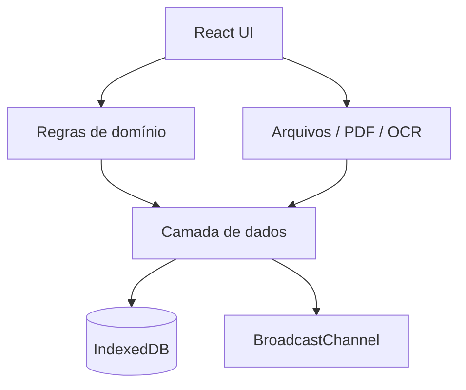
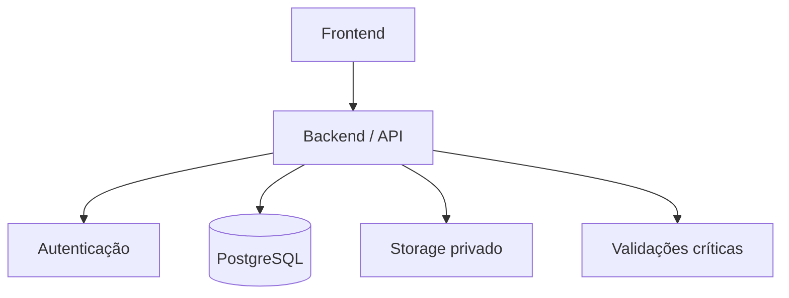

# Arquitetura do EstampaPro

## Visão geral

O EstampaPro foi construído como um protótipo funcional local, priorizando validação de fluxo e regras de negócio antes da adoção de infraestrutura remota.

## Interface

A interface é organizada por áreas funcionais: dashboard, pedidos, clientes, financeiro, histórico, arquivos e configurações.

## Domínio

As regras de negócio controlam pontos como:

- elegibilidade para avanço de etapa;
- aprovação;
- conferência de peças;
- cobrança;
- recebimento;
- alocação de pagamentos;
- encerramento e reabertura de pedidos.

## Persistência atual

O protótipo usa IndexedDB para registros e arquivos locais. Isso permite uma experiência funcional sem backend, mas não substitui uma arquitetura de produção.

A sincronização entre abas ocorre via `BroadcastChannel`.

## Processamento local

PDF, OCR e leitura de planilhas são tratados no navegador. Isso reduz dependência externa durante a fase de protótipo e mantém os arquivos no ambiente local do usuário.

## Arquitetura planejada para produção

A evolução para produção deve incluir autenticação, autorização, banco de dados remoto, armazenamento privado, backup e validação de regras críticas no servidor.

## Observação sobre este repositório

A documentação pública descreve decisões e componentes em nível de produto. A implementação e a organização interna detalhada permanecem privadas.
